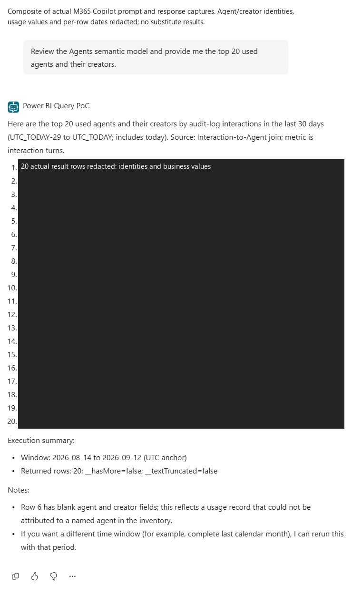

# Copilot Studio + Power BI

**An experimental standard Copilot Studio agent for metadata-grounded DAX generation, execution, and explanation. No Fabric data agent is required.**

This repository packages a proof of concept, its reusable agent source, and a publication-ready documentation site. It is intentionally private while the implementation and documentation are reviewed. GitHub Pages is not enabled.

> **About the example model:** `Agent365` is the name of a **custom Power BI semantic model/report** used in this demonstration. It is **not the Microsoft Agent 365 product**, an official Agent 365 schema, or an Agent 365 product integration. The architecture is reusable with other compatible Power BI semantic models; adapt the model contract, queries, configuration, permissions, and tests to your model.

## Start here

- [Visual walkthrough](docs/index.html) — architecture, example conversations, screenshots, and caveats. Open this file locally; it has no build step.
- [Architecture and execution identity](docs/architecture.md)
- [Setup and adaptation](docs/setup.md)
- [Download and import the unmanaged starter solution](docs/solution-import.md)
- [Full instruction, topic and connector reference](docs/topic-and-tool-reference.md)
- [Published M365 tests, exact prompts and real redacted screenshots](docs/m365-testing.md)
- [Example prompts and output contracts](docs/examples.md)
- [Evidence and known limitations](docs/verification.md)
- [Capabilities, model discovery, and scaling limits](docs/capabilities-and-limits.md)
- [Second-report scalability experiment](docs/scalability-experiment.md)
- [Public-release checklist](docs/public-release.md)

## Current status: core workflow observed working

The five-metric compiler and fixed business-query paths have been replaced in the deployed design.
The new capabilities retrieve governed model metadata and accept **new DAX table expressions**
authored by the orchestrator, rather than mapping questions to a predefined metric list.

**The published M365 Copilot agent has now been browser-tested:** a generic request returned
20 agents with creators in descending usage order; a top-five follow-up matched the previous
first five; and an advice request returned explicitly unexecuted DAX with filter-context explanation.
See the [exact prompts, observed checks and real redacted screenshots](docs/m365-testing.md).
Earlier Studio successes were user-observed. No unredacted identity-bearing results are published.

This is scoped PoC success, not universal correctness. The earlier combined, single-turn
two-ranking request remains unresolved; matching post-correction traces and every displayed
value have not been independently verified. Earlier traces did establish successful provider
queries whose rows were lost locally, leading to the response-handling correction.

The published generic query action now retains `firstTableRows` as dynamic `Any` and serializes
the array directly, preserving arbitrary generated aliases and numeric precision. Explicit
`includeNulls=false` omits DAX blank fields; empty strings are retained. TOJSON was evaluated
but rejected because tested fractional values were truncated. No per-question query mapping
was introduced. Metadata gating and Invoker identity are unchanged.

The three obsolete fixed tools are deleted; generic capabilities appear under **Topics**.
Native readback and the rendered picker show GPT-5 Reasoning (Preview). Current UI warnings concern
the preview model and absence of a formal Studio evaluation; inference telemetry remains unverified.
Earlier evaluator/SDK blockers and their separate
identities are documented in [verification](docs/verification.md).

### Deployed design

**Question -> authorized metadata retrieval -> LLM-generated table expression -> validated execution envelope -> Power BI as the caller -> explanation.**

| Capability | Implementation and boundary |
|---|---|
| Metadata | Owner-prepared snapshot; requesting-user schema visibility probe before disclosure |
| Query generation | New table expressions over actual fields/measures; no five-metric, grouping, or owner-field enumeration |
| Query form | DAX table expression plus output aliases/order, not an arbitrary full `EVALUATE/DEFINE/ORDER BY` script |
| Dates | Generated scalar expressions using engine-provided `UTC_TODAY`, `QUERY_START`, and `QUERY_END` |
| Results | Up to 100 rows, 16 columns, and 256 characters per text cell; explicit count/truncation envelope |
| Advice | Compile and explain proposed DAX without executing the business query; metadata authorization still uses a zero-row probe |
| Models | Only the original model, alias `primary`, is onboarded |

The primary snapshot contains **21 tables, 244 columns, 166 measure names, and 13 relationships**.
It includes retained structural metadata, not complete business semantics or exact measure
implementations. Preparation/refresh uses an already-authorized owner with read/write model access;
agent users receive no new permissions.

Eight varied direct-query cases passed, including combinations outside the retired compiler and a
top-100 membership/order regression. The current offline suite comprises **50 Python tests and
5 client-harness tests**, plus 55 synthetic native Power Fx checks. The native null-serialization
caveat is documented in [verification](docs/verification.md). These are not cloud-generated
conversational-query evidence.

The useful top-100 presentation remains a regression goal, not a runtime business-query dependency.
No successful new-runtime screenshot is fabricated. See [architecture](docs/architecture.md),
[capabilities and limits](docs/capabilities-and-limits.md), and [verification](docs/verification.md).

**Second-model evidence:** a separate approved model accepted constant DAX and automatic structural
definition retrieval. That model is **not a runtime option**. See the [separate experiment](docs/scalability-experiment.md).

## Repository layout

```text
agent/                  Sanitized, environment-independent agent source
solution/               Importable unmanaged starter ZIP, unpacked source and checksums
examples/               Synthetic examples and a public-safe M365 observation summary
scripts/                Packaging and documentation validation
docs/
  index.html            Self-contained, GitHub Pages-ready walkthrough
  assets/               Sanitized screenshots and editable architecture
.github/workflows/      Manual-only, public-repository-gated Pages deployment
```

Tenant-bound solution exports, credentials, connection IDs, sync caches, live transcripts, and raw customer data are deliberately excluded. This is an adaptation kit, not a preauthenticated one-click deployment.

**[Download the solution ZIP](solution/PowerBIQueryStarter_unmanaged.zip).** Its import was verified
as a separate unpublished agent. It deliberately stops before queries until you bind your own
connection, prepare the target model metadata, customize business definitions and deploy the generated
topics. The demo report/model and report-specific guidance are not bundled.
Follow the [complete import and customization guide](docs/solution-import.md), not just an ID replacement.

## Architecture at a glance


## Screenshots and examples



This genuine prompt/response composite is explicitly labeled and uses opaque redactions, not
invented result values. [All current channel tests and authoring captures](docs/m365-testing.md)
include consent, follow-up, advice, active topics, the empty standalone Tools tab and model settings.
Formatting and semantic-verification limitations are documented alongside the images.


This actual UI crop shows the **initial three-tool PoC**, not the later enhancement or proof of query success. See [screenshot provenance and previews](docs/screenshots.md).


The answer illustration is **synthetic**, not a customer result or a product screenshot. It preserves the intended ranked-table presentation without publishing business data.

## Prerequisites

- Copilot Studio authoring/runtime licensing and an appropriate Power Platform environment.
- Power BI licensing appropriate to the model and workspace.
- An authenticated user with **Read and Build** access to the model.
- The tenant's **Dataset Execute Queries REST API** setting enabled.
- Power Platform data policies that permit the required connector.
- A governed, current metadata snapshot and a Power BI connection configured for **end-user / Invoker** execution.
- An already-authorized model owner for definition preparation/refresh; do not grant model-write access to every agent user.

Build permission is more powerful than report-viewing permission. Review the model's data access before granting it. Row-level security follows the effective execution identity and Power BI workspace role; agent instructions are not an authorization boundary.

## Local preview

Open `docs/index.html` directly, or run:

```powershell
python -m http.server 8080 --bind 127.0.0.1 --directory docs
```

Then visit `http://127.0.0.1:8080`. The site loads no external fonts, analytics, or JavaScript libraries.

Validate the publication bundle:

```powershell
python scripts\validate_publication.py
```

To rebuild the site and editable diagram after changing their source:

```powershell
python scripts\build_architecture.py
python scripts\build_site.py
```

Both builds use only the Python standard library. `scripts\preview_site.py` is an optional screenshot/interaction check that requires Python Playwright and an installed Microsoft Edge browser; it launches its own headless browser and does not use a signed-in profile.

## Publication status

**Private repository; no public site.** The Pages workflow is manual-only and refuses to deploy from a private repository. Before changing visibility, follow the release checklist, choose a license, and review all source, history, and imagery. A private repository does not guarantee that a subsequently enabled Pages site will be private.

## Microsoft references

- [Power BI connector: Run a query against a dataset](https://learn.microsoft.com/en-us/connectors/powerbi/#run-a-query-against-a-dataset)
- [Power BI Execute Queries API](https://learn.microsoft.com/en-us/rest/api/power-bi/datasets/execute-queries)
- [Copilot Studio agent flows](https://learn.microsoft.com/en-us/microsoft-copilot-studio/advanced-flow-create)
- [Power BI remote MCP server](https://learn.microsoft.com/en-us/power-bi/developer/mcp/remote-mcp-server-get-started)

The hosted Power BI MCP server is an optional, separate route. It is not used by this connector-based implementation. Its `Generate Query` tool has Power BI Copilot entitlement/capacity requirements; these must not be confused with a requirement for a Fabric data agent.
