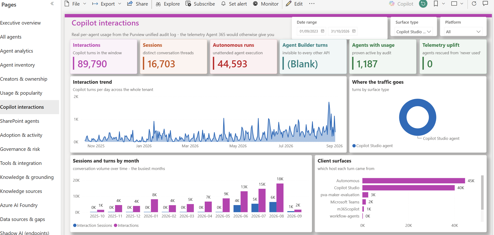
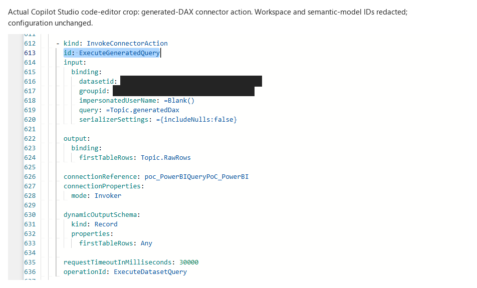

# Copilot Studio + Power BI

**An experimental standard Copilot Studio agent for metadata-grounded DAX generation, execution, and explanation. No Fabric data agent is required.**

**Built in Copilot Studio; used inside Microsoft 365 Copilot.** The tested agent has the
**Microsoft 365 Copilot channel configured** and is published and made available through that
channel. The screenshots show users interacting with this Copilot Studio agent in M365 Copilot,
not an agent created with Microsoft 365 Copilot's Agent Builder. Its instructions, native topics
and Power BI connector actions are authored and managed in Copilot Studio.

Ask a question about your Power BI semantic model: the configured agent uses prepared metadata to
generate new DAX, executes it with the requesting user's permissions, and explains the results.
You do not need a fixed query or separate tool for each question.

The downloadable ZIP is an unpublished Copilot Studio starter with no channel registration.
After configuring it for your model, publish it and configure the M365 Copilot channel in your
own tenant; [channel setup and testing steps](docs/setup.md#publish-and-test-in-m365-copilot)
are included.

**[Open the GitHub Pages walkthrough](https://ryanbowie.github.io/copilot-studio-powerbi-agent/)** for
the architecture, real anonymized screenshots, solution download and setup steps.

> **About the example model:** `Agent365` is the name of a **custom Power BI semantic model/report** used in this demonstration. It is **not the Microsoft Agent 365 product**, an official Agent 365 schema, or an Agent 365 product integration. The architecture is reusable with other compatible Power BI semantic models; adapt the model contract, queries, configuration, permissions, and tests to your model.

**Tested with a Power BI semantic model containing agents**, including agent inventory,
creator/ownership and usage data. This is why the examples ask for agent rankings, creators and
interactions. The agent runs DAX against the semantic model, not against report visuals.



This owner-approved screenshot shows the custom report's **Copilot interactions** page, not an
agent response. Its date window differs from the conversation tests; totals are not a like-for-like
comparison. The report, semantic model and report-specific business definitions are not bundled in
the solution ZIP.

## Start here

- [Published walkthrough](https://ryanbowie.github.io/copilot-studio-powerbi-agent/) — architecture, screenshots, download and setup. The [self-contained local copy](docs/index.html) also opens without a build step.
- [Architecture and execution identity](docs/architecture.md)
- [Setup and adaptation](docs/setup.md)
- [Download and import the unmanaged starter solution](docs/solution-import.md)
- [Full instruction, topic and connector reference](docs/topic-and-tool-reference.md)
- [Complete synthetic native topic YAML](agent/example-topics/README.md)
- [Published M365 tests, exact prompts and real redacted screenshots](docs/m365-testing.md)
- [Example prompts and output contracts](docs/examples.md)
- [Evidence and known limitations](docs/verification.md)
- [Capabilities, model discovery, and scaling limits](docs/capabilities-and-limits.md)
- [Second-report scalability experiment](docs/scalability-experiment.md)
- [Public-release checklist](docs/public-release.md)

## Current status: core workflow observed working

The five-metric compiler and fixed business-query paths have been replaced in the deployed design.
The new capabilities retrieve governed model metadata and accept **new DAX table expressions**
authored by the orchestrator, rather than mapping questions to a predefined metric list.

**The published M365 Copilot agent has now been browser-tested:** a generic request returned
20 agents with creators in descending usage order; a top-five follow-up matched the previous
first five; and an advice request returned explicitly unexecuted DAX with filter-context explanation.
See the [exact prompts, observed checks and real redacted screenshots](docs/m365-testing.md).
Earlier Studio successes were user-observed. No unredacted identity-bearing results are published.

This is scoped PoC success, not universal correctness. The earlier combined, single-turn
two-ranking request remains unresolved; matching post-correction traces and every displayed
value have not been independently verified. Earlier traces did establish successful provider
queries whose rows were lost locally, leading to the response-handling correction.

The published generic query action now retains `firstTableRows` as dynamic `Any` and serializes
the array directly, preserving arbitrary generated aliases and numeric precision. Explicit
`includeNulls=false` omits DAX blank fields; empty strings are retained. TOJSON was evaluated
but rejected because tested fractional values were truncated. No per-question query mapping
was introduced. Metadata gating and Invoker identity are unchanged.

The three obsolete fixed tools are deleted; generic capabilities appear under **Topics**.
Native readback and the rendered picker show GPT-5 Reasoning (Preview). Current UI warnings concern
the preview model and absence of a formal Studio evaluation; inference telemetry remains unverified.
Earlier evaluator/SDK blockers and their separate
identities are documented in [verification](docs/verification.md).

### Deployed design

**Question -> authorized metadata retrieval -> LLM-generated table expression -> validated execution envelope -> Power BI as the caller -> explanation.**

| Capability | Implementation and boundary |
|---|---|
| Metadata | Owner-prepared snapshot; requesting-user schema visibility probe before disclosure |
| Query generation | New table expressions over actual fields/measures; no five-metric, grouping, or owner-field enumeration |
| Query form | DAX table expression plus output aliases/order, not an arbitrary full `EVALUATE/DEFINE/ORDER BY` script |
| Dates | Generated scalar expressions using engine-provided `UTC_TODAY`, `QUERY_START`, and `QUERY_END` |
| Results | Up to 100 rows, 16 columns, and 256 characters per text cell; explicit count/truncation envelope |
| Advice | Compile and explain proposed DAX without executing the business query; metadata authorization still uses a zero-row probe |
| Models | Only the original model, alias `primary`, is onboarded |

The primary snapshot contains **21 tables, 244 columns, 166 measure names, and 13 relationships**.
It includes retained structural metadata, not complete business semantics or exact measure
implementations. Preparation/refresh uses an already-authorized owner with read/write model access;
agent users receive no new permissions.

Eight varied direct-query cases passed, including combinations outside the retired compiler and a
top-100 membership/order regression. The current offline suite comprises **54 Python tests and
5 client-harness tests**, plus 55 synthetic native Power Fx checks. The native null-serialization
caveat is documented in [verification](docs/verification.md). These are not cloud-generated
conversational-query evidence.

The useful top-100 presentation remains a regression goal, not a runtime business-query dependency.
No successful new-runtime screenshot is fabricated. See [architecture](docs/architecture.md),
[capabilities and limits](docs/capabilities-and-limits.md), and [verification](docs/verification.md).

**Second-model evidence:** a separate approved model accepted constant DAX and automatic structural
definition retrieval. That model is **not a runtime option**. See the [separate experiment](docs/scalability-experiment.md).

## Repository layout

```text
agent/                  Sanitized, environment-independent agent source
solution/               Importable unmanaged starter ZIP, unpacked source and checksums
examples/               Synthetic examples and a public-safe M365 observation summary
scripts/                Packaging and documentation validation
docs/
  index.html            Self-contained, GitHub Pages-ready walkthrough
  assets/               Sanitized screenshots and editable architecture
.github/workflows/      Manual-only, public-repository-gated Pages deployment
```

Tenant-bound solution exports, credentials, connection IDs, sync caches, live transcripts, and raw customer data are deliberately excluded. This is an adaptation kit, not a preauthenticated one-click deployment.

**[Download the solution ZIP](solution/PowerBIQueryStarter_unmanaged.zip).** Its import was verified
as a separate unpublished agent. It deliberately stops before queries until you bind your own
connection, prepare the target model metadata, customize business definitions and deploy the generated
topics. The demo report/model and report-specific guidance are not bundled.
Follow the [complete import and customization guide](docs/solution-import.md), not just an ID replacement.

## Architecture at a glance


[Detailed architecture](docs/assets/architecture.svg) and editable Excalidraw sources
([simple](docs/assets/architecture-simple.excalidraw), [detailed](docs/assets/architecture.excalidraw)).

## Screenshots and examples


This genuine prompt/response composite is explicitly labeled. With owner approval, only people's
names are masked; agent names, usage figures and dates are unchanged. No values are invented.
[All current channel tests and authoring captures](docs/m365-testing.md)
include consent, follow-up, advice, active topics, actual connector configuration and model settings.
Formatting and semantic-verification limitations are documented alongside the images.

The old **Top 100 agents** conversation starter is now **Analyze agent usage**, saved and published
with a generic top-20/creator prompt. [The actual Studio capture](docs/assets/studio-updated-starter.png)
shows the change. A post-publication M365 landing reload still showed the old label; channel
presentation is not claimed updated.

## Tools and topics

The reusable capabilities are **native Topics with embedded Power BI connector actions**,
not a standalone tool per question.

| Topic | Trigger | Purpose |
|---|---|---|
| Get model metadata | Generative selection | Verify requester schema visibility; return governed metadata |
| Run generated DAX | Generative selection | Validate and execute newly generated DAX as the user |
| Compile DAX advice | Generative selection | Compile proposed DAX without executing the business query |
| Generated query error | OnError | Report the actual error and stop |



The connector operation is `ExecuteDatasetQuery`; its query is `Topic.generatedDax`, not a fixed
top-100 expression. In Studio, select **+ Add node > Add a tool > Connector > Power BI >
Run a query against a dataset** inside the topic. Metadata probing and business-query execution
use that same action; advice and error handling are native topic logic.
The [manual connector wiring guide](docs/topic-and-tool-reference.md#build-the-connector-actions-yourself)
lists the exact fields, formula bindings, output schemas and required surrounding logic.
Read the [complete topic inputs, outputs, triggers and configuration captures](docs/topic-and-tool-reference.md),
[full agent instructions](agent/agent.mcs.yml), and [all four complete synthetic topic YAML definitions](agent/example-topics/README.md).
These screenshots show the configured demo; the ZIP remains deliberately unconfigured.
See [screenshot provenance and previews](docs/screenshots.md).


The answer illustration is **synthetic**, not a customer result or a product screenshot. It preserves the intended ranked-table presentation without publishing business data.

## Prerequisites

- Copilot Studio authoring/runtime licensing and an appropriate Power Platform environment.
- Power BI licensing appropriate to the model and workspace.
- An authenticated user with **Read and Build** access to the model.
- The tenant's **Dataset Execute Queries REST API** setting enabled.
- Power Platform data policies that permit the required connector.
- A governed, current metadata snapshot and a Power BI connection configured for **end-user / Invoker** execution.
- An already-authorized model owner for definition preparation/refresh; do not grant model-write access to every agent user.

Build permission is more powerful than report-viewing permission. Review the model's data access before granting it. Row-level security follows the effective execution identity and Power BI workspace role; agent instructions are not an authorization boundary.

## Local preview

Open `docs/index.html` directly, or run:

```powershell
python -m http.server 8080 --bind 127.0.0.1 --directory docs
```

Then visit `http://127.0.0.1:8080`. The site loads no external fonts, analytics, or JavaScript libraries.

Validate the publication bundle:

```powershell
python scripts\validate_publication.py
```

To rebuild the site and editable diagram after changing their source:

```powershell
python scripts\build_architecture.py
python scripts\build_site.py
```

Both builds use only the Python standard library. `scripts\preview_site.py` is an optional screenshot/interaction check that requires Python Playwright and an installed Microsoft Edge browser; it launches its own headless browser and does not use a signed-in profile.

## Publication status

**Public repository and documentation website, released with owner approval after privacy review.**
The review covered current files, tracked history, screenshots and the exact import-verified solution ZIP.
People's names are masked in result screenshots; actual agent names, usage and dates remain visible
with owner approval. Resource IDs and personal identities are redacted in configuration captures.
Unredacted originals and tenant configuration remain excluded.
See the [release review](docs/public-release.md) for scope and limitations.

Pages deployment remains manual-only and gated to public repositories. After reviewing future
changes, run **Actions > Publish reviewed documentation > Run workflow**. The workflow checks that
the committed site matches its source and validates the publication bundle before deploying `docs`.
No open-source license has been selected; public visibility alone does not grant additional reuse rights.

## Microsoft references

- [Power BI connector: Run a query against a dataset](https://learn.microsoft.com/en-us/connectors/powerbi/#run-a-query-against-a-dataset)
- [Power BI Execute Queries API](https://learn.microsoft.com/en-us/rest/api/power-bi/datasets/execute-queries)
- [Copilot Studio agent flows](https://learn.microsoft.com/en-us/microsoft-copilot-studio/advanced-flow-create)
- [Power BI remote MCP server](https://learn.microsoft.com/en-us/power-bi/developer/mcp/remote-mcp-server-get-started)

The hosted Power BI MCP server is an optional, separate route. It is not used by this connector-based implementation. Its `Generate Query` tool has Power BI Copilot entitlement/capacity requirements; these must not be confused with a requirement for a Fabric data agent.
