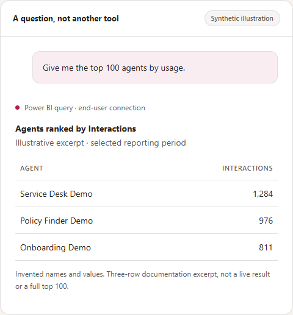

# General-question examples and evidence labels

These are prompts and expected answer contracts for the **generated-DAX design**, not predefined
metric mappings. No successful new-runtime conversation is fabricated. Names/numbers in the ranking
illustration are synthetic; direct test fixtures are not proof of cloud query generation.

`Agent365` is the custom example model/report, not Microsoft Agent 365.

## Metadata before querying

> What tables and measures are in this model? Retrieve the model metadata before answering.

Expected behavior: invoke metadata retrieval, complete its requesting-user visibility probe, and
answer from the prepared catalog. State snapshot freshness and avoid treating missing descriptions
or an access failure as proof that data does not exist.

**Observed result:** after the numeric output-type correction, the user's Studio answer listed the
model catalog, measures, snapshot freshness and relationships. Metadata retrieval now succeeds.
The later business query's successful provider rows were lost locally; its dynamic-output repair
still needs final caller-visible ranking confirmation. Separate automated-client authorization
boundaries are not diagnoses of this user's connection.

## Multiple dimensions and filters

> Compare usage by platform and region, filtered to two specified environment types. Show the query you used.

The orchestrator should find the actual relevant columns/measures, generate the combined expression,
and explain the resulting metric and filters. The old one-group/one-filter limit no longer defines
the expression contract.

Do not invent categorical values. If the user has not supplied them and metadata does not establish
them, clarify or use an authorized bounded lookup.

## A derived calculation

> Calculate sessions per user by platform and explain what that ratio means.

The proposed formula should use verified measure names and handle division by zero. It must explain
the measure grain and avoid asserting that ratios or distinct counts are additive across groups.

Illustrative table expression using names from the example model, **not a captured cloud-generated
answer or an executed-as-shown result**:

```dax
SUMMARIZECOLUMNS(
    'Agent'[Platform],
    "SessionsPerUser", DIVIDE([Interaction Sessions], [Interaction Users])
)
```

The actual tool receives a table expression and projection/order metadata; it forms its own bounded
execution envelope. This example is not an arbitrary full DAX script to paste as a tool argument.

## Dates beyond one fixed period

> Give me the top agents and their usage over the last 30 days.

> Compare the last complete calendar month with the preceding month.

The model can generate paired scalar date expressions from the engine's `UTC_TODAY` context and
use `QUERY_START`/`QUERY_END` in the table expression. It must state the interpretation, retain the
requested interval, and distinguish observed records from completeness/refresh claims.

See [date semantics](date-filtering.md). Reference checks do not prove that arbitrary generated
filter logic is semantically correct; observe the actual query.

## Top-100 presentation

> Give me the top 100 agents by usage.

The ranking is now a regression goal for the generic expression path, not a fixed-query tool
dependency. Preserve ranking order and the requested available rows up to the 100-row limit.



Only three invented rows are shown in the illustration. The direct generic-contract regression
matched the original top-100 membership/order; that is not a successful new cloud-chat transcript.

## Explain DAX without executing it

> Write DAX for sessions by month and explain filter context. Do not execute the business query.

Expected behavior: retrieve authorized metadata and compile suggested DAX. The metadata visibility
probe may run, but the proposed business query must not. Label the code **UNEXECUTED** and do not
claim a measure was created or saved.

Exact measure expressions are not retained by the current metadata preparation path. The agent must
not pretend to know an existing measure's implementation merely because its name is in the catalog.

## Owner/creator questions and actual access

> Which fields describe an agent's creator, and can you count records with that information?

The old blanket owner-field exclusion has been removed from the generic contract. Use the actual
retrieved schema and requesting-user permissions; do not claim a field is absent because an earlier
PoC omitted it. Direct owner/creator aggregate-count checks did not print identities.

This repository still excludes personal/business values from examples and screenshots. Removing an
invented query-field ban is not permission to publish private results or bypass RLS/OLS.

## Unknown or ambiguous questions

> Rank agents by satisfaction.

Establish whether there is a relevant metric and what it means. Do not substitute interaction count
for satisfaction. Explain missing context or actual access failures without inventing schema or
results. A new expression is not automatically a correct business answer.
