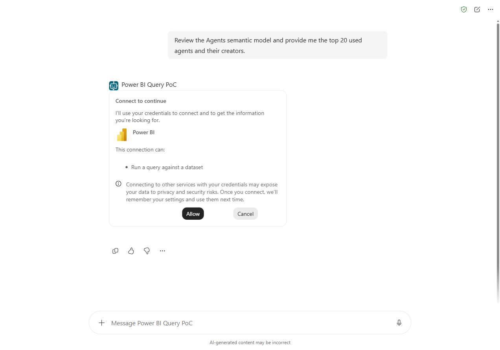
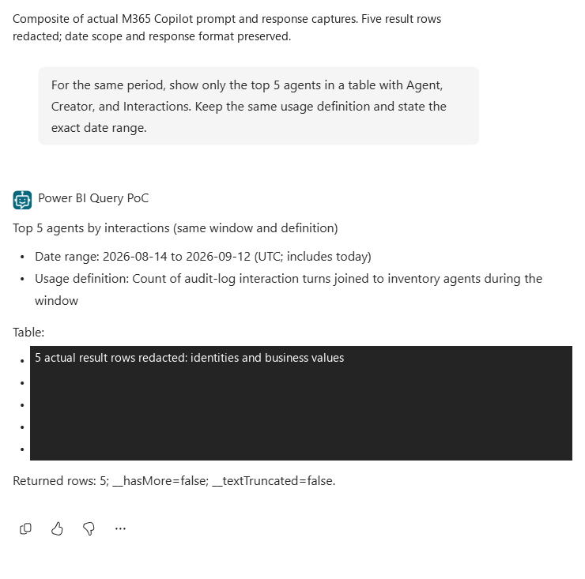
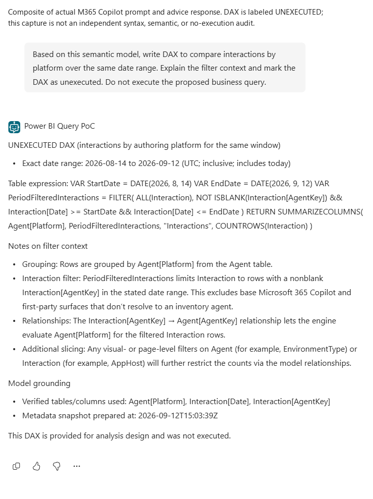
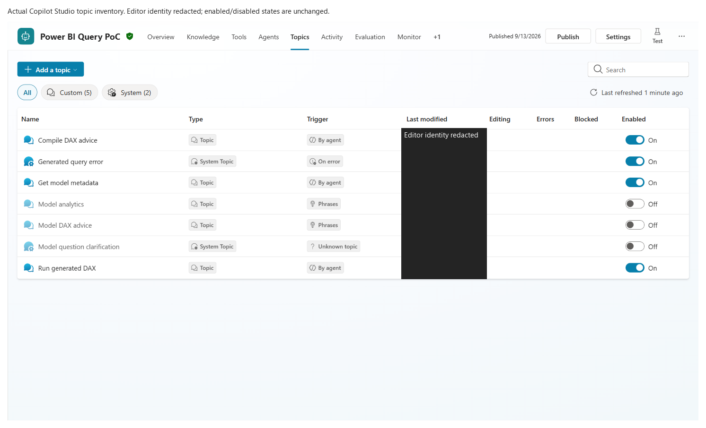
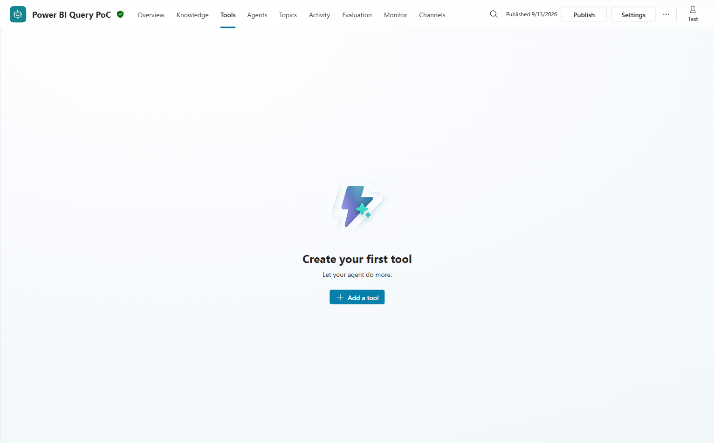
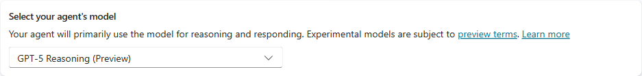
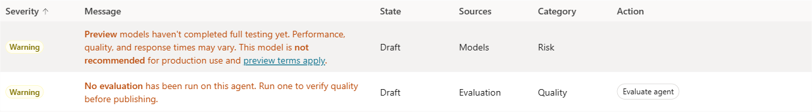
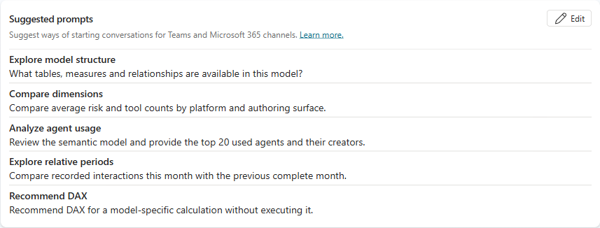

# Published M365 Copilot tests and screenshots

**Three prompts completed in the real published M365 Copilot UI.** These are browser-observed
responses, not fabricated transcripts or direct-API substitutes. The checks below establish
response shape and conversational consistency, not independent numerical correctness for all data.

Testing took place on 13 September 2026 local UK time, while the UTC date was still 12 September.
The tenant-specific agent link, conversation identifiers, original result images and business
values remain private. The working deployment was not changed to make these tests pass.

## Results

| Scenario | Observed result | Boundary |
|---|---|---|
| Generic top-20 request with creators | 20 rows; numeric usage descending; 20 distinct displayed usage values; creators included | Agent chose and declared a 30-day period although the prompt did not specify one; values not independently audited |
| Contextual top-five follow-up | Exactly five rows matched the first response's first five names, creators and usage values; date range retained | Rendered a list rather than the requested table; does not prove a fresh query was necessary or executed |
| Model-grounded DAX advice | Explicit UNEXECUTED label, same dates, table expression and filter-context explanation | Displayed as prose rather than a code block; syntax, semantics and absence of business-query execution not independently instrumented |

The earlier repeated-value ranking concern remains deferred, not fixed or disproved by these
different prompts. The original combined single-turn two-scope request is also not reverified.

## 1. Generic model review and ranking

> Review the Agents semantic model and provide me the top 20 used agents and their creators.

The first invocation displayed the normal Power BI connection-consent card. Selecting **Allow**
permitted the agent to use the existing requesting-user connection; no model permissions or
execution identity were changed.

The response defined usage as audit-log interaction turns and declared the inclusive UTC range
14 August-12 September 2026. Twenty rows were present and sorted by the displayed numeric usage
values. The response reported no more-row or text-truncation flags. A blank agent/creator row was
retained and discussed, rather than replaced with invented identity values.

An extra per-row timestamp was displayed without a column label. Its meaning was not independently
established; the screenshot is not an endorsement of that presentation.

## 2. Contextual refinement

> For the same period, show only the top 5 agents in a table with Agent, Creator, and Interactions. Keep the same usage definition and state the exact date range.

A private in-browser comparison confirmed that all five displayed agent/creator/usage triples
matched the first five rows of the previous response. The same date range and metric were stated.
The output was a list with separators, not a rendered table; this format deviation is retained
in the capture rather than edited into an apparently compliant table.

## 3. DAX advice

> Based on this semantic model, write DAX to compare interactions by platform over the same date range. Explain the filter context and mark the DAX as unexecuted. Do not execute the proposed business query.

The response explicitly labeled the expression **UNEXECUTED** and said it had not executed the
business query. It retained the dates and described grouping, filtering and relationships.
The UI result alone does not prove which internal capabilities ran. Metadata authorization can
still execute a zero-row probe; the proposed analytical query is a separate operation.

Treat the displayed expression and explanation as advice to review, not verified DAX. In particular,
filter-removal and outer-filter interactions require semantic testing before reuse in another context.

## Current authoring surfaces

The generic runtime appears under **Topics**. Four capabilities are enabled; three retired bounded
topics remain off. The standalone **Tools** tab no longer contains the original fixed-query tools:
the Power BI connector calls are nodes inside the active topics.

The rendered model picker was observed as **GPT-5 Reasoning (Preview)**. This is UI-selection
evidence, not inference-model telemetry.

The current Agent Status panel reported two warnings: preview-model production suitability, and
no formal Studio evaluation having run. The browser checks in this document are not that formal
evaluation feature, and the model selection was not changed to suppress the warning.

## Updated conversation starter

**Top 100 agents** was a suggested prompt, not a surviving fixed-query tool. It is now
**Analyze agent usage**, with a generic top-20/creator question:

> Review the semantic model and provide the top 20 used agents and their creators.

The change was saved, native-verified and published at **00:38:17 UTC on 13 September 2026**.
This genuine Studio crop independently confirms the new title and prompt:

A M365 landing reload around **00:45 UTC**, after publication, still displayed the old starter.
The earlier 00:01 UTC observation preceded this publication. Neither observation is evidence that
the new label reached M365. Microsoft documents
[possible suggested-prompt propagation delays](https://learn.microsoft.com/en-us/microsoft-copilot-studio/configure-starter-prompts);
the specific cause here was not established. The channel was not removed/re-added merely to force
a cosmetic refresh, and the completed test conversation was preserved.

## Capture and privacy method

The prompt/response images are explicitly labeled composites of real element screenshots from the
same conversation. Result cells containing names, creators, values and per-row dates were covered
with opaque pixels. No synthetic values were substituted. UI inventory captures exclude the
environment/account header and redact the editor identity. The consent and advice captures
contain no personal result rows.

Private originals and rectangle specifications are not committed. The reusable
[`redact_capture.py`](../scripts/redact_capture.py) helper creates publication derivatives without
overwriting originals. Every derivative was visually reviewed. These images are distinct from the
older, explicitly synthetic ranking illustration.

The owner subsequently authorized a public repository and GitHub Pages release after privacy review.
Only these reviewed derivatives are included; original captures and business rows remain private.
Publishing an agent into M365 Copilot does not itself authorize public release of its data.
