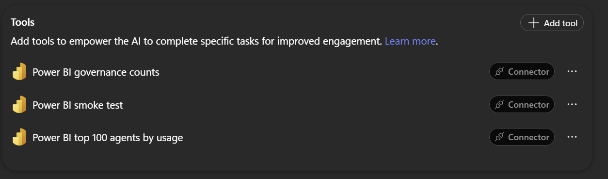
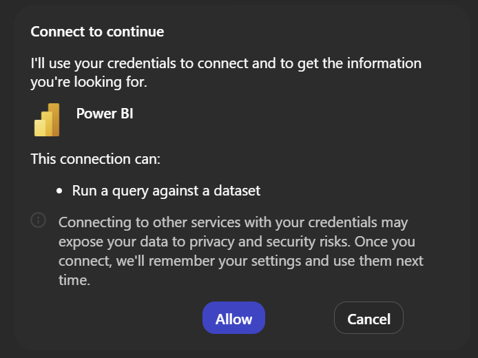

# Screenshots and provenance

## Current published M365 and Studio captures

See the [M365 test walkthrough](m365-testing.md) for exact prompts, results and limitations.
These captures come from actual browser tests, not the synthetic illustration below.

| Asset | What it records |
|---|---|
| `m365-connection-consent.png` | Generic prompt and normal Power BI Allow/Cancel card |
| `m365-ranking-redacted.png` | Genuine top-20 prompt/response composite; all sensitive result cells masked |
| `m365-followup-redacted.png` | Genuine contextual top-five composite; result cells masked |
| `m365-dax-advice.png` | Genuine advice prompt/response composite; DAX explicitly labeled unexecuted |
| `studio-current-topics.png` | Four active and three inactive topics; editor identity masked |
| `studio-current-tools.png` | Empty standalone Tools tab; connector actions reside in topics |
| `studio-model-selection.png` | Actual GPT-5 Reasoning (Preview) picker |
| `studio-current-warnings.png` | Current preview-model and formal-evaluation warnings |
| `studio-updated-starter.png` | Actual saved Analyze agent usage title/prompt in Studio; not M365 propagation evidence |

Opaque pixel replacement removes identities and business values. No replacement business values
are invented. Prompt/response composites are labeled as such; browser scrolling and a taller
viewport made the actual content visible without changing its text. Originals remain private.

## Historical Copilot Studio interface

The following PNGs are crops of a screenshot supplied by the user during the initial PoC on 12 September 2026. They retain actual UI pixels; only the surrounding area was cropped away. Embedded source-image metadata was not carried into the exported images.

### Initial tool registration

Shows three connector tools: governance counts, smoke test, and top-100 ranking. This is a **historical initial-state screenshot**, not the latest enhancement's inventory.

### Connection approval

Shows the requesting user's consent step. **This is not a completed query result.** Registering a connection, binding a reference, and approving agent use are distinct steps.

## Synthetic output illustration

Rendered from this repository's walkthrough. **Not a screenshot of Copilot Studio, a live answer, or execution evidence.** Every agent name and number is invented and explicitly labeled. Only three example rows appear; the live top-100 scenario should preserve its requested limit.

## Documentation-site previews

These are screenshots of the documentation itself, not a deployed public GitHub Pages site:

- [Light desktop preview](assets/walkthrough-light.png)
- [Dark desktop preview](assets/walkthrough-dark.png)
- [Mobile preview](assets/walkthrough-mobile.png)

## Public-release review

Later user-supplied screenshots confirmed a dated usage ranking and a contextual creator/owner
follow-up. They contain business values and, in the follow-up, real names, emails and identifiers.
They are deliberately not copied into this repository or embedded in the site. The successful
scenarios are documented in [verification](verification.md) without those values. The synthetic
ranking illustration remains labeled synthetic; it is not substituted as photographic proof.

The owner approved public release after the current and historical imagery was reviewed. Real
identities and business-result cells remain masked, with no substitute values. Continue reviewing
new images at full resolution before publication. Microsoft product UI and trademarks remain their
owners' property; no additional intellectual-property license is implied by public visibility.
