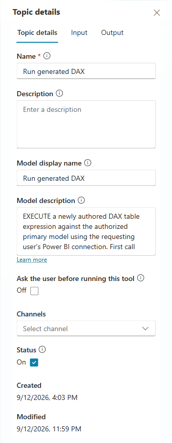
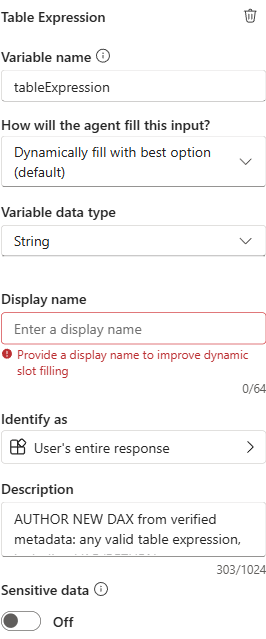

# Instructions, topics and connector details

**The configured runtime uses generic native topics, not a separate tool for each question.**
Read the [full agent instructions and starters](../agent/agent.mcs.yml), the
[complete topic generator](../agent/general_runtime.py), the
[DAX envelope/boundary implementation](../agent/generated_dax.py) and
[dynamic result transport](../agent/query_transport.py).

Four **complete synthetic native YAML definitions**, including every action and input/output
schema, are available in [the reference topic folder](../agent/example-topics/README.md):
[metadata](../agent/example-topics/ModelMetadata.mcs.yml),
[execution](../agent/example-topics/GeneratedDaxQuery.mcs.yml),
[advice](../agent/example-topics/GeneratedDaxAdvice.mcs.yml) and
[error handling](../agent/example-topics/GeneratedQueryError.mcs.yml).
The [machine-readable index](../agent/example-topics/index.json) describes their interfaces.
These use invented Entity/Event metadata and placeholder resources, not a deployed snapshot.
Regenerate them offline with `python example_topics.py` from the `agent` directory.

The [importable solution's complete native source](../solution/src) is also included. Its metadata
topic is intentionally an onboarding stop rather than a live catalog, and query/advice begin with
configuration stops. The [import guide](solution-import.md) explains how deployment replaces these
stops with topics generated from your authorized model. Do not confuse the unconfigured ZIP with
the working demonstration's private generated metadata.

## Capability inventory

| Studio name | Schema suffix | Trigger | Configured behavior |
|---|---|---|---|
| Get model metadata | `topic.ModelMetadata` | Generative selection | Validate alias/view, probe requester schema visibility, return governed catalog or selected tables |
| Run generated DAX | `topic.GeneratedDaxQuery` | Generative selection | Require current-turn/user metadata gate, validate expression/envelope, execute and return bounded rows |
| Compile DAX advice | `topic.GeneratedDaxAdvice` | Generative selection | Same expression contract; compile without executing the proposed business query |
| Generated query error | `topic.GeneratedQueryError` | OnError | Report error and stop rather than fabricate an answer |

The original three fixed connector tools are deleted in the demonstration. Three historical bounded
topics remain inactive there; they are not included in the starter solution.
Connector invocations are embedded nodes in the active topics, not separate fixed-query tool cards.

## Actual Studio configuration

These genuine crops show the configured working demo, not the deliberately unconfigured ZIP.
No runtime settings were edited or saved to capture them.

The execution topic is enabled and its model-facing description distinguishes execution from
advice. Ask-before-running is off; Power BI connection consent and permissions still apply.

The `tableExpression` input is dynamically filled. Studio's visible display-name warning is
retained in the screenshot; the technical variable name and description are configured.
The description directs the orchestrator to author new DAX from verified metadata, including
VAR/RETURN, SUMMARIZECOLUMNS, FILTER, CALCULATETABLE, ADDCOLUMNS, SELECTCOLUMNS, UNION and derived
calculations. It is not a fixed query or finite business-metric mapping.

The action binds `query` to `Topic.generatedDax`, leaves `impersonatedUserName` blank and uses
`connectionProperties.mode: Invoker`. It declares `firstTableRows: Any`, explicit null omission,
a 30,000 ms timeout and `operationId: ExecuteDatasetQuery`. Resource IDs are masked, not replaced.

## Metadata inputs

| Name | Type | Meaning |
|---|---|---|
| `modelAlias` | String | Blank defaults to `primary`; another supplied alias rejects |
| `view` | String | `catalog` or `tables` |
| `tableNames` | String | Comma-separated verified table names, at most four; blank for catalog |

The configured metadata topic validates a numeric `[AccessProbe]` marker from a zero-row query
referencing the prepared model's columns before disclosing its snapshot. It declares
`firstTableRows` as a table with that numeric column. Alias/input rejection, connector failure and
returned-row decoding failure are separate stages. Narrower OLS users may need a suitable snapshot.

## Query and advice inputs

| Name | Type | Meaning |
|---|---|---|
| `modelAlias` | String | Same fixed primary-model rule |
| `tableExpression` | String | New DAX table expression, not a full EVALUATE/DEFINE/ORDER BY script |
| `columns` | String | 1-16 distinct output aliases, comma-separated |
| `sortBy` | String | Declared aliases plus asc/desc; remaining aliases are tie breakers |
| `limit` | Number | Integer 1-100, default 20 |
| `startDateExpression` | String | Optional scalar DAX date expression; paired with end |
| `endDateExpression` | String | Optional scalar DAX date expression; paired with start |

The orchestrator fills technical inputs; users ask business questions, not write connector arguments.
Native automatic inputs are non-prompting; runtime checks still reject missing/invalid required
business-query material. Dates use `UTC_TODAY`, `QUERY_START` and `QUERY_END`, with declared calendar
semantics. Resource IDs and execution identity are not model-authored input parameters.

## Shared outputs

| Name | Type | Interpretation |
|---|---|---|
| `status` | String | success, advice, rejected or stopped; completion alone is not success |
| `stage` | String | Local validation, connector or decoder boundary |
| `connectorAttempted` | Boolean | Advanced to the connector, not proof of authorization/completion |
| `connectorReturned` | Boolean | Connector returned normally, not proof its rows passed validation |
| `probeResultStatus` | String | Probe result/decoding classification |
| `visibilityVerified` | Boolean | Requester's metadata probe was validated |
| `resolvedModelAlias` | String | Resolved fixed alias |
| `error` | String | Actual contract or envelope error |
| `result` | String | Verified metadata or bounded result-envelope JSON |
| `generatedDax` | String | Compiled DAX; not by itself evidence of execution |

The OnError topic has no declared task inputs/outputs. Its complete handling is in `build_error_topic`.

## Power BI connector action

**In the Studio action picker, choose Power BI > Run a query against a dataset.**
Its connector ID is `shared_powerbi` and operation ID is `ExecuteDatasetQuery`.
The four friendly names above are custom topics, not four built-in connector actions.

| Topic | Real connector action used |
|---|---|
| Get model metadata | **Run a query against a dataset**, for schema-visibility probing only; the topic then returns prepared metadata |
| Run generated DAX | **Run a query against a dataset**, for the compiled business query |
| Compile DAX advice | None in this topic; native Power Fx compiles advice. The separate metadata topic may probe Power BI |
| Generated query error | None; native error handling |

The configured query uses the standard connector's `ExecuteDatasetQuery` operation,
with a trusted workspace/model mapping and `Invoker` mode. There is no custom connector or hosted
MCP dependency. The requesting user still needs appropriate Power BI permissions and consent.

The query action declares `firstTableRows: Any` and serializes the dynamic array directly to preserve
arbitrary aliases and numeric precision. `serializerSettings.includeNulls=false` is explicit:
omitted declared aliases mean DAX BLANK/null; empty strings remain empty strings. The bounded
envelope carries Summary and Data rows, count/status checks, date bounds and truncation flags.
Malformed output stops locally; it is not repaired by rerunning unrelated DAX or granting access.

## Build the connector actions yourself

1. Prepare your model metadata and the native topics using the [setup guide](setup.md) and
   [model-specific import/customization guide](solution-import.md). Set the three callable topics
   up for generative selection, and retain the separate OnError topic.
2. In Copilot Studio, open **Topics > Run generated DAX** (your custom topic).
   On the canvas choose **+ Add node > Add a tool > Connector**.
   Search for **Power BI**, then choose **Run a query against a dataset**.
   These are [Microsoft's documented topic-tool steps](https://learn.microsoft.com/en-us/microsoft-copilot-studio/advanced-connectors#add-a-tool-from-a-prebuilt-connector-in-a-topic).
3. Create or select the Power BI connection. Keep **user credentials**, represented by
   `connectionProperties.mode: Invoker` in native YAML. Bind your own connection reference.
   Do not switch to maker credentials or grant additional model rights merely to make a test pass.
4. Configure the following fields. The topic must declare and populate the variables first;
   entering a variable name as plain query text is not a formula binding.

| Studio field / native key | Run generated DAX configuration |
|---|---|
| Workspace / `groupid` | Your authorized workspace, fixed configuration |
| Dataset / `datasetid` | Your semantic model, fixed configuration |
| Query text / `query` | Formula `Topic.generatedDax`; native YAML `=Topic.generatedDax` |
| Impersonate user / `impersonatedUserName` | Leave blank; native YAML `=Blank()` |
| Output / `firstTableRows` | Bind to `Topic.RawRows`; native dynamic output schema is `Any` |
| Native `serializerSettings` | `={includeNulls:false}` |
| Native `requestTimeoutInMilliseconds` | `30000` |

`Topic.generatedDax` contains the **complete compiled query**, including its execution envelope.
Do not wire the raw `tableExpression` input straight into Query text: it is not the full query
and would skip this implementation's envelope and validation. Retain direct serialization with
`JSON(Topic.RawRows)` and the result checks from the complete query-topic source.

For **Get model metadata**, add the **same connector action**, with the same fixed resources and
Invoker connection. Its query is the model-specific visibility probe generated during preparation,
not `Topic.generatedDax`. Bind `firstTableRows` to `Topic.ProbeRows` and retain the numeric
`[AccessProbe]` table schema and validation shown in the complete metadata-topic source.
Only after that check does the topic disclose its prepared snapshot. There is no separate
Power BI connector action named "Get model metadata" that automatically provides this behavior.

Do **not** add a business-query connector call to Compile DAX advice, or any connector to
Generated query error. Preserve their native compilation/error logic.

Adding these two action nodes alone is not the complete agent: use the linked full native topic
definitions for the metadata gate, input schemas, compilation, bounded results and error handling,
plus the [full agent instructions](../agent/agent.mcs.yml). The supplied example YAML uses synthetic
Entity/Event metadata; generate your own rather than copying those example field names into a real
model. Verify the parsed action bindings and test with the intended requesting user's permissions
before publishing. The [Power BI action reference](https://learn.microsoft.com/en-us/connectors/powerbi/#run-a-query-against-a-dataset)
documents the connector, not the surrounding custom topic logic.

Limits and caveats: [capabilities and limits](capabilities-and-limits.md).
Actual published-channel prompts/captures: [M365 testing](m365-testing.md).

## Starters are not tools

The historical **Top 100 agents** label was a conversation starter after the fixed tool's deletion.
It does not restrict supported questions or prove a dedicated ranking tool remains installed.
It has now been changed to **Analyze agent usage**, with the prompt:

> Review the semantic model and provide the top 20 used agents and their creators.

The change was native-verified and published on 13 September 2026 at 00:38:17 UTC.
The [actual Studio screenshot](assets/studio-updated-starter.png) independently confirms both
fields. A M365 landing reload around 00:45 UTC still displayed the old label, so M365 presentation
is not claimed updated. Microsoft documents possible propagation delays; the specific cause was
not established. No channel removal, permission change or unrelated runtime modification was made.
The new importable starter uses separate model-neutral prompts.
